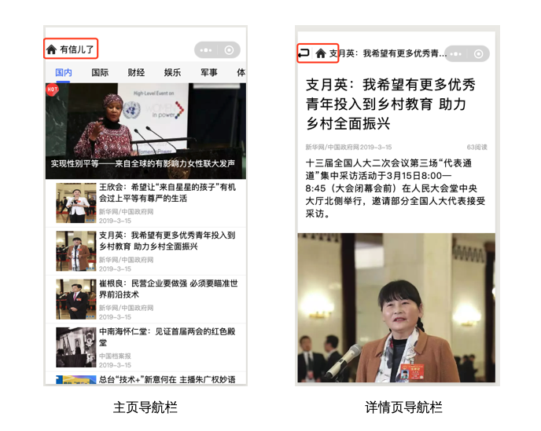

# 有信儿了：Udacity 小程序课程作业Project1
<!--code for small app project in Udacity's wechat course-->

## 概览
这是我Udacity小程序课程[Project1【新闻小程序】](https://github.com/udacity/wmpnd-news)的作业代码，本次完成的小程序名称叫“有信儿了”，使用的是Udacity提供的API获取的数据。主要实现了首页展示不同类型的新闻列表、展示热点新闻以及详情页展示新闻详情的功能。

<center>
    <figure class="image">
        
        <figcaption >图1 “有信儿了”最终的首页</figcaption>
    </figure>
</center>

## 业务问题总结

### 新闻类别切换

这里主要要实现的就是通过导航栏点击切换新闻列表和滑动新闻列表切换导航栏新闻类别名称，这里主要是通过微信小程序自带的swiper和scroll-view实现了这两个功能。具体代码我参考了[https://blog.csdn.net/Sophie_U/article/details/71745125?fps=1&locationNum=1](https://blog.csdn.net/Sophie_U/article/details/71745125?fps=1&locationNum=1)。

### 热门新闻展示
在index.js的onLoad中我需要获得所有类别新闻的id，然后使用id去获取所有新闻的详情以获取新闻的阅读量，最后通过阅读量来排序取前三作为热门新闻进行展示。这里需要注意的是微信小程序自带的wx.request是异步执行的，但是我需要获取完所有新闻的阅读量才能排序获得热门新闻。这里我使用了Promise对异步wx.request进行封装。

```javascript
const hotTopicListHelper = (newsType) => {
  // 返回一个Promise实例对象
  return new Promise((resolve, reject) => {
    wx.request({
      url: "https://test-miniprogram.com/api/news/list",
      data: {
        type: newsType,
      },
      success: res => {
        let tempList = []
        res.data.result.forEach(
          (item) => {
            tempList.push(item.id)
          }
        )
        resolve(tempList)
      }
    })
  })
}
```

### 自定义导航栏
第一次提交后Udacity的老师反馈缺少自定义导航栏，并建议使用component来构建自定义导航栏。作业中的自定义导航栏会根据不同的页面展示不同的图标，首页只有一个主页图标，详情页会有返回和首页图标，页面类型信息会通过使用component的代码的数据绑定进行传递。

<center>
    <figure class="image">
        
        <figcaption >图2 不同导航栏示意图</figcaption>
    </figure>
</center>


### 下拉刷新和上拉加载更多
作业代码中的下拉刷新和上拉加载更多都是使用微信小程序自带接口onPullDownRefresh和onReachBottom。在实现上拉加载更多的时候发现如果所有内容没有超过一页是不会触发onReachBottom的，所以在处理页面组件所占空间的时候会故意多出一些空间让内容超过一页。
``` javascript
onLoad: function () {
    this.getHotTopic()
    this.getNewsList()
    // 根据不同的设备计算scroll-view的高度，目标为超出屏幕一点点，这样才能触发onReachBottom
    wx.getSystemInfo({
        success: (res) => {
        // 设备总高度为 app.globalData.clientHeight, 单位px
        // 新闻类别导航栏（class:tab-h）的高度为80rpx
        // 热点新闻展示窗口（class:head）的高度为360rpx
        // 预留50rpx确保所有内容超出一个屏幕
        // 所有px通过乘rpxRate转换为rpx
        let winHeight = (app.globalData.clientHeight - app.globalData.navHeight)* app.globalData.rpxRate - 360 - 80 + 50;
        let bottomPadding = 0;
        // iPhone X、iPhone XR等设备屏幕最下方系统自带条形图标会挡住某些内容，增加padding-bottom来避免 
        if (app.globalData.deviceType == 1) { bottomPadding = 20}
        this.setData({
            winHeight: winHeight,
            bottomPadding: bottomPadding,
        });
        }
    });
}
```
## 代码问题总结

稍后就来...


